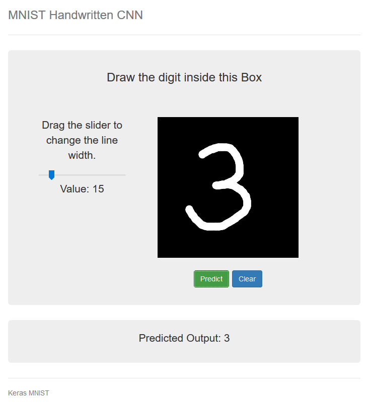

# **Machine Learning Application Server** for handwritten digit recognition

## Principle

1. Set up a **Working Machine** to train a model of handwritten digit recognition
  (and which can be stopped afterward)

2. Set up a **Front-End Machine** with a *web server* for the handwritten digit recognition application

3. A **Back-End Machine** with a *python server* for the predictions
   (ideally in a private subnet, but not in this tutorial)

## Architecture

1. Create a **VPC** (CIDR: 192.168.0.0/16)

2. Create a **Public Subnet** (CIDR: 192.168.0.0/24)

3. Create an **Internet Gateway** and attach it to the VPC

4. Edit the **Route Table** 

    | Public Subnet Route Table | |
    | --- | --- |
    | Destination | Target |
    | 10.0.0.0/16 | local |
    | 0.0.0.0/0 | IGW |

5. Launch three EC2 instances
   (for example *Ubuntu Server 18.04 LTS (HVM), SSD Volume Type - ami-04b9e92b5572fa0d1*)
    - for the *Working Machine*, choose an **Instance Type** with enough capacity
    (for example *m5.xlarge* with 4 vCPUs and 16 GiB memory)
    - for the front and back-end machines a more basic instance type (e.g., *t2.micro*) is enough

6. If a **Public IP** has not been assigned at launch, then allocate
   three new **Elastic IP addresses**  and associate them to each machine

7. Edit the **Security Groups** of the instances
    - for the working machine, open port 8888 for the connection to Jupyter Notebooks
    - for the front-end machine, open port 80 (HTTP) for the connection with the web server
    - for the back-end machine, open port 5000 used by `Flask` Python web framework

    <br/>

    | Working Machine Security Group | | | | |
    | --- |--- | --- | --- | --- |
    | | Type | Ports | Protocol | Source |
    | Inbound | SSH | 22 | TCP | 0.0.0.0/0 |
    | | Custom TCP Rule | 8888 | TCP | 0.0.0.0/0 |
    | Outbound | all traffic | all | all | 0.0.0.0/0 |

    | Front-End Machine Security Group | | | | |
    | --- |--- | --- | --- | --- |
    | | Type | Ports | Protocol | Source |
    | Inbound | SSH | 22 | TCP | 0.0.0.0/0 |
    | | HTTP | 80 | TCP | 0.0.0.0/0 |
    | Outbound | all traffic | all | all | 0.0.0.0/0 |

    | Back-End Machine Security Group | | | | |
    | --- |--- | --- | --- | --- |
    | | Type | Ports | Protocol | Source |
    | Inbound | SSH | 22 | TCP | 0.0.0.0/0 |
    | | Custom TCP Rule | 5000 | TCP | 0.0.0.0/0 |
    | Outbound | all traffic | all | all | 0.0.0.0/0 |

## Training the model on the Working Machine

1. Connect to the machine via ssh

    ```
    PS> ssh -i myKeyPair.pem ubuntu@<wm_public_dns>
    ```

2. First thing first, we need to update the package tool 

    ```
    $ sudo apt-get update
    ```

3. Install `Miniconda` (and restart the shell) 

    ```
    $ wget https://repo.anaconda.com/miniconda/Miniconda3-latest-Linux-x86_64.sh
    $ sh Miniconda3-latest-Linux-x86_64.sh
    $ exec $SHELL
    ```

   If conda command is not found after installation: `$ export PATH=~/miniconda3/bin:$PATH`

4. Create a new environment with Python 3, install packages `ipykernel`, `jupyter`, 
   `tensorflow`, `keras` (with `conda`), `opencv-python` (with `pip`) and then
   install a Python kernel in the new environment

    ```
    $ conda create -n myenv python=3.6
    $ conda activate myenv
    $ conda install ipykernel jupyter
    $ conda install tensorflow 
    $ conda install keras
    $ pip install opencv-python
    $ python -m ipykernel install --user --name myenv --display-name "Python 3 (myenv)"
    ``` 

   See `Files/wm_requirements.txt` for precise versions of packages

5. From local machine, export `Files/00-mnist-cnn.ipynb` (and `Files/9.png`) to remote working machine

    ```
    PS> scp -i myKeyPair.pem ./00-mnist-cnn.ipynb ubuntu@<wm_public_ip>:/home/ubuntu/
    ``` 

6. In the remote host, run Jupyter Notebook in background, allowing any distant machine to connect to it

    ```
    $ nohup jupyter notebook --ip=0.0.0.0 &
    ```

   (To stop the notebook:  `$ jupyter notebook stop`)

7. Connect to the notebook by typing in any browser `<wm_public_ip>:8888/?token=<token>`
   (the token can be accessed in `nohup.out` file) and then launch the notebook (it saves the model in `cnn-mnist`)

## Front-End Web Server

1. Connect to the machine via ssh

    ```
    PS> ssh -i myKeyPair.pem ubuntu@<frontend_public_dns>
    ```

2. Update the package tool 

    ```
    $ sudo apt-get update
    ```

3. Install `apache` web server

    ```
    $ sudo apt-get install apache2
    ```

4. From local machine, export `Files/index.html` and `Files/static/*` to remote machine

    ```
    PS> scp -i myKeyPair.pem ./index.html ubuntu@<frontend_public_ip>:/home/ubuntu/
    PS> scp -i myKeyPair.pem ./static/* ubuntu@<frontend_public_ip>:/home/ubuntu/static/
    ``` 

5. Move `index.html` and `static/` to the default *Ubuntu document root* `/var/www/html`

    ```
    $ sudo mv index.html /var/www/html
    $ sudo mv static /var/www/html
    ``` 

6. In the `index.html` file, change the target IP (public or private IP) of the back-end machine

7. We can now access the web application by typing in any browser `http:\\<frontend_public_ip>`

## Back-End Python Server 

1. Connect to the machine via ssh

    ```
    PS> ssh -i myKeyPair.pem ubuntu@<backend_public_dns>
    ```

2. Update the package tool 

    ```
    $ sudo apt-get update
    ```

3. Install `Miniconda` (and restart the shell) 

    ```
    $ wget https://repo.anaconda.com/miniconda/Miniconda3-latest-Linux-x86_64.sh
    $ sh Miniconda3-latest-Linux-x86_64.sh
    $ exec $SHELL
    ```

   If conda command is not found after installation: `$ export PATH=~/miniconda3/bin:$PATH`

4. Create a new environment with Python 3, install packages `tensorflow` then
   `keras`, `imageio`, `Flask`

    ```
    $ conda create -n myenv python=3.6
    $ conda activate myenv
    $ conda install tensorflow
    $ conda install keras imageio Flask
    ``` 

   See `Files/backend_requirements.txt` for precise versions of packages

5. Install Flask extension for handling *Cross Origin Resource Sharing* (CORS)

    ```
    conda install flask-cors
    ```

6. From local machine, export Python script `keras_flask.py` to remote backend machine

    ```
    PS> scp -i myKeyPair.pem ./keras_flask.py ubuntu@<backend_public_ip>:/home/ubuntu/
    ``` 

   and from remote working machine, export the model `cnn-mnist` to remote backend machine

    ```
    $ scp -i myKeyPair.pem ./cnn-mnist ubuntu@<backend_private_ip>:/home/ubuntu/
    ``` 

7. Et voilà!

   
