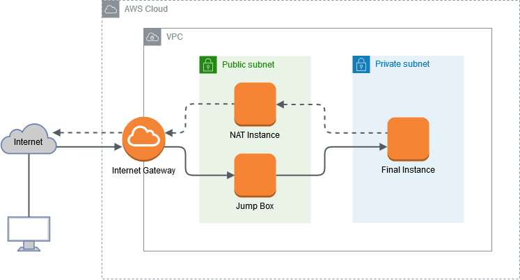
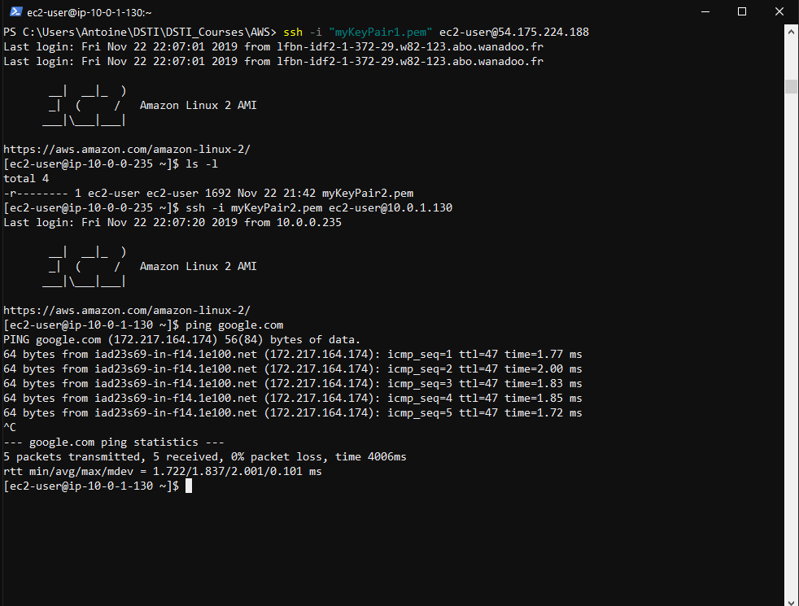

# Connecting a **Final Instance** in a Private Subnet of an AWS VPC to a **Jump Box** and a **NAT Instance**

  

## Setting up the infrastructure

1. Create a **VPC** (CIDR: 10.0.0.0/16)

2. Create two subnets 

    - **Public Subnet** (CIDR: 10.0.0.0/24)

    - **Private Subnet** (CIDR: 10.0.1.0/24)

3. Create an **Internet Gateway** and attach it to the VPC

4. Create two **Route Tables** and edit the RT association for each subnet

    | Public Subnet Route Table | |
    | --- | --- |
    | Destination | Target |
    | 10.0.0.0/16 | local |
    | 0.0.0.0/0 | IGW |
  
    | Private Subnet Route Table (for now...) | |
    | --- | --- |
    | Destination | Target |
    | 10.0.0.0/16 | local |
   
## Launching the EC2 instances

1. In the **Public Subnet**, launch an instance (e.g., Amazon Linux 2 AMI) for the **Jump Box** 

2. If necessary, allocate a new **Elastic IP address** and associate it to the JB

3. In the **Private Subnet**, launch an instance (e.g., Amazon Linux 2 AMI) for the **Final Instance**

4. In the **Public Subnet**, launch an *amzn-ami-vpc-nat* instance
(in the *Community AMIs* category) for the **NAT Instance**

5. If necessary, allocate a new **Elastic IP address** and associate it to the NAT


## Connecting to the Final Instance through the Jump Box

1. Edit the Security Group of the JB and the FI

    |Jump Box Security Group | | | | 
    | --- |--- | --- | --- |
    | | Ports | Protocol | Source |
    | Inbound | 22 | SSH | 0.0.0.0/0 |
    | Outbound | all | all | 0.0.0.0/0 |
    
    | Final Instance Security Group | | | | 
    | --- |--- | --- | --- |
    | | Ports | Protocol | Source |
    | Inbound | 22 | SSH | 10.0.0.0/16 |
    | Outbound | all | all | 0.0.0.0/0 |
 
2. Transfer to the JB the Key-Pair file associated with the FI (using secure copy protocol `scp`)

    ```
    PS> scp -i JB_KeyPair.pem FI_KeyPair.pem ec2-user@<public_ip_address>:/home/ec2-user/
    ```

3. Connect to the JB via ssh

    ```
    PS> ssh -i JB_KeyPair.pem ec2-user@<public_ip_address>
    ```

4. From the JB, connect to the FI via ssh with Private IP address:

    ```
    $ ssh -i FI_KeyPair.pem ec2-user@10.0.1.xyz
    ```

## Connecting the Final Instance to the Internet via the NAT Instance

1. Disable *Source/Destination Checks* for the NAT Instance

2. Edit the Route Table of the Private Subnet to send the Internet requests of the FI to the NAT Instance:

    | Private Subnet Route Table | |
    | --- | --- |
    | Destination | Target |
    | 10.0.0.0/16 | local |
    | 0.0.0.0/0 | NAT |

3. Edit the Security Group of the NAT Instance to allow protocols
  (such as, for instance, ICMP for `$ ping`) 

    | NAT Instance Security Group | | | | 
    | --- |--- | --- | --- |
    | | Ports | Protocol | Source |
    | Inbound | N/A | ICMP | 0.0.0.0/0 |
    | Outbound | all | all | 0.0.0.0/0 |

## ET VOILA!

  
