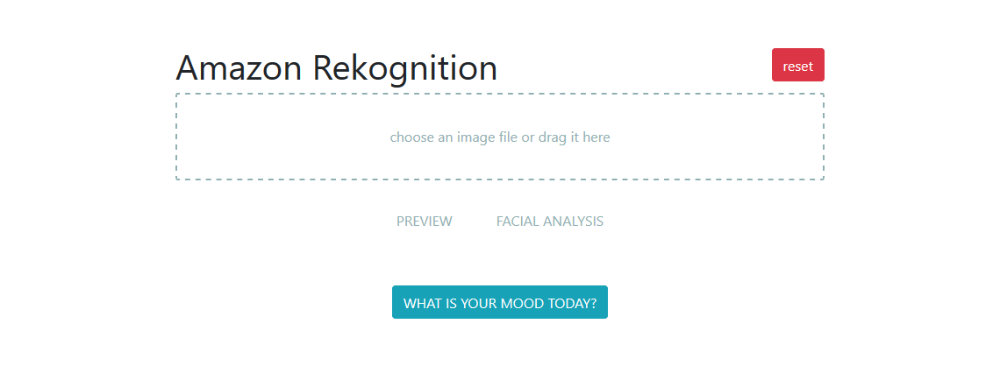
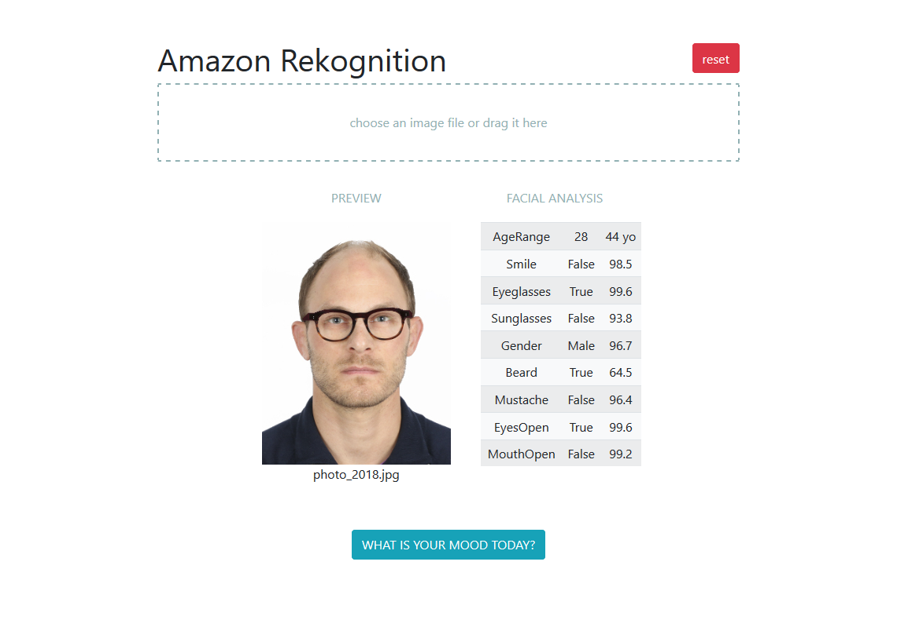
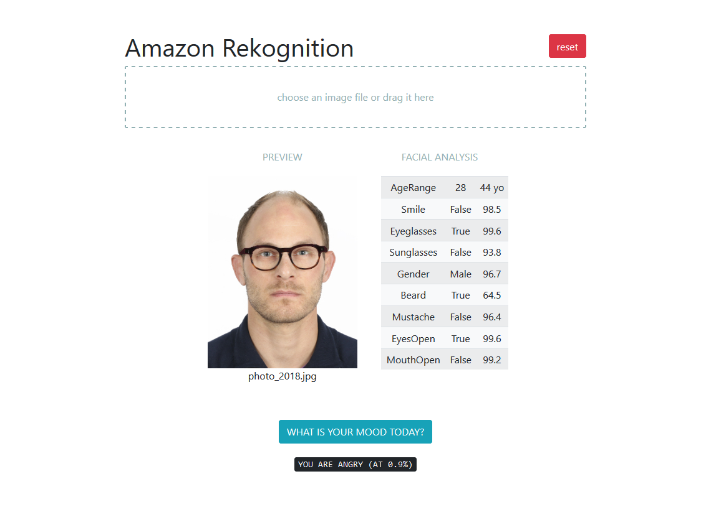

# Amazon **Rekognition Application Server**

## Principle

1. Set up a **Front-End Machine** with a *web server* to upload a picture, analyze it
with **Amazon Rekognition** and predict your mood

3. Set up a **Back-End Machine** with a *python server* for the predictions
   (ideally in a private subnet, but not in this tutorial)

## Network Architecture

1. Create a **VPC** (CIDR: 192.168.0.0/16)

2. Create a **Public Subnet** (CIDR: 192.168.0.0/24)

3. Create an **Internet Gateway** and attach it to the VPC

4. Edit the **Route Table** 

    | Public Subnet Route Table | |
    | --- | --- |
    | Destination | Target |
    | 10.0.0.0/16 | local |
    | 0.0.0.0/0 | IGW |

5. Launch two EC2 instances
   (for example *Ubuntu Server 18.04 LTS (HVM), SSD Volume Type - ami-04b9e92b5572fa0d1*)
   with a basic Instance Type (e.g., *t2.micro*)

6. If a **Public IP** has not been assigned at launch, then allocate
   new **Elastic IP addresses**  and associate them to each machine

7. Edit the **Security Groups** of the instances
    - for the front-end machine, open ports 80 (HTTP) and 443 (HTTPS) for the connection with the web server
    - for the back-end machine, open port 5000 used by `Flask` Python web framework

    <br/>

    | Front-End Machine Security Group | | | | |
    | --- |--- | --- | --- | --- |
    | | Type | Ports | Protocol | Source |
    | Inbound | SSH | 22 | TCP | 0.0.0.0/0 |
    | | HTTP | 80 | TCP | 0.0.0.0/0 |
    | | HTTPS | 443 | TCP | 0.0.0.0/0 |
    | Outbound | all traffic | all | all | 0.0.0.0/0 |

    | Back-End Machine Security Group | | | | |
    | --- |--- | --- | --- | --- |
    | | Type | Ports | Protocol | Source |
    | Inbound | SSH | 22 | TCP | 0.0.0.0/0 |
    | | Custom TCP Rule | 5000 | TCP | 0.0.0.0/0 |
    | Outbound | all traffic | all | all | 0.0.0.0/0 |

## Front-End Web Server

1. Connect to the machine via ssh

    ```
    PS> ssh -i myKeyPair.pem ubuntu@<frontend_public_dns>
    ```

2. Update the package tool 

    ```
    $ sudo apt-get update
    ```

3. Install `apache` web server

    ```
    $ sudo apt-get install apache2
    ```

4. From local machine, export `Files/index.html` and `Files/static/*` to remote machine

    ```
    PS> scp -i myKeyPair.pem ./index.html ubuntu@<frontend_public_ip>:/home/ubuntu/
    PS> scp -i myKeyPair.pem ./static/* ubuntu@<frontend_public_ip>:/home/ubuntu/static/
    ``` 

5. Move `index.html` and `static/` to the default *Ubuntu document root* `/var/www/html`

    ```
    $ sudo mv index.html /var/www/html
    $ sudo mv static /var/www/html
    ``` 

6. In the `static/app.js` file, change the target IP (public IP) of the back-end machine (variable `backend_ip`)

7. We can now access the web application by typing in any browser `http:\\<frontend_public_ip>`

   

## Back-End Python Server 

1. Connect to the machine via ssh

    ```
    PS> ssh -i myKeyPair.pem ubuntu@<backend_public_dns>
    ```

2. Update the package tool 

    ```
    $ sudo apt-get update
    ```

3. Install `Miniconda` (and restart the shell) 

    ```
    $ wget https://repo.anaconda.com/miniconda/Miniconda3-latest-Linux-x86_64.sh
    $ sh Miniconda3-latest-Linux-x86_64.sh
    $ exec $SHELL
    ```

   If conda command is not found after installation: `$ export PATH=~/miniconda3/bin:$PATH`

4. Create a new virtual environment with Python 3, install packages `Flask` and `boto3`

    ```
    $ conda create -n myenv python=3.6
    $ conda activate myenv
    $ conda install Flask boto3
    ``` 

5. Install Flask extension for handling *Cross Origin Resource Sharing* (CORS)

    ```
    conda intall flask-cors
    ```

6. Configure AWS credentials:
    - create a file `~/.aws/credentials` with the *Access Key ID* and the *Secret Access Key*,
    which looks like that:

    <br/>

    ```
    [default]
    aws_access_key_id=XXXXXXXXXXXXXXXXXXXX
    aws_secret_access_key=XXXXXXXXXXXXXXXXXXXXXXXXXXXXXXXXXXXXXXXX
    aws_session_token=XXXXXXXXXXXXXXXXXXXXXXXXXXXXXXXXXX
    ```

    - a file `~/.aws/config` with the default region:

    <br/>

    ```
    [default]
    region = us-east-1
    ```

6. From local machine, export Python script `rekognition.py` to remote backend machine

    ```
    PS> scp -i myKeyPair.pem ./rekognition.py ubuntu@<backend_public_ip>:/home/ubuntu/
    ``` 

7. Create an **S3 bucket** with name `image-for-mood-reko` to store the picture to analyze
   (see in `rekognition.py`)

   **Nota**: the name of the bucket must be unique across all existing bucket names in Amazon S3,
   so use your own and update `rekognition.py` script accordingly

8. Make sure `myenv` virtual environment is active and then run Flask app

   ```
   $ python rekognition.py
   ```

## Results

1. After uploading the picture:

   

2. If you want to know in which mood you are, just click the button
   (I am angry apparently, but just  a little bit!)

   

