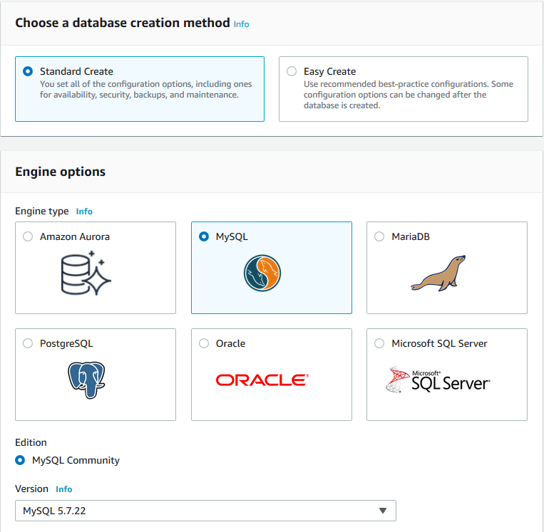

# Setting up an AWS **RDS Instance** and connecting to it

## Setting up the infrastructure

To create a database on AWS, we need a VPC with two subnets
in **two distinct availability zones**.  

1. Create a **VPC** (CIDR: 192.168.0.0/16)

2. Create one **Public Subnet** (CIDR: 192.168.0.0/24) in one AZ

3. Create another **Subnet** (public or private) (CIDR: 192.168.1.0/24) in a *different* AZ

4. Create an **Internet Gateway** and attach it to the VPC</br>
    Create and/or edit the *Route Tables*

    | Public Subnet Route Table | |
    | --- | --- |
    | Destination | Target |
    | 192.168.0.0/16 | local |
    | 0.0.0.0/0 | IGW |

5. For *publicly accessible* database,
  enable **DNS resolution** and **DNS hostnames** for the VPC

## Create a database




Edit the **Security Group** created for the RDS instance (named *RDS-SG* here) to access it
from a *distant computer* and/or from an *EC2 instance inside the VPC*

|RDS-SG Security Group | | | | |
| --- |--- | --- | --- | --- |
| | Type | Ports | Protocol | Source |
| Inbound (for external access) | MYSQL/Aurora | 3306 | TCP | \<my_public_ip\>/32 |
| Inbound (for internal access) | MYSQL/Aurora | 3306 | TCP | 192.168.0.0/16 |
| Outbound | | all | all | 0.0.0.0/0 |


## Connecting to the database

To connect to the database, we need (some of) the following information:

* hostname = \<database_endpoint\>
* port = 3306
* username = admin
* password = \*\*\*\*\*\*\*\*\*\*
* database name = mydb

### Connecting from outside the VPC with Python

0. To connect to the RDS instance, we can use the python library `pymyplot`

1. We first create a config file (`rds_config.py`) containing the credentials for the RDS instance

    ```python
    host = "<database_endpoint>"
    username = "admin"
    password = "**********"
    dbname = "mydb" 
    ```

2. To connect to the database we execute the following code 

    ```python
    import pymysql
    import rds_config

    dbhost = rds_config.host
    dbuser = rds_config.username
    dbpassword = rds_config.password
    dbname = rds_config.dbname

    conn = pymysql.connect(host = dbhost, user = dbuser, password = dbpassword, db = dbname)
    ```

3. We can then create a table and insert some data

    ```python
    cur = conn.cursor()
    cur.execute("CREATE TABLE Menu (Dish varchar(24), Spam int, Eggs int, Bacon int)")
    cur.execute("INSERT INTO Menu (Dish, Spam, Eggs, Bacon) VALUES ('Egg and bacon', 0, 1, 1)")
    cur.execute("INSERT INTO Menu (Dish, Spam, Eggs, Bacon) VALUES ('Egg and spam', 1, 1, 0)")
    cur.execute("INSERT INTO Menu (Dish, Spam, Eggs, Bacon) VALUES ('Egg, bacon and spam', 1, 1, 1)")
    conn.commit()
    ```

4. And print it

    ```python
    cur.execute('SELECT * FROM Menu')
    for dish in cur:
      print(dish)
    ``` 

5. We finally need to close the connection

    ```python
    conn.close()
    ``` 

    

### Connecting from an EC2 instance within the VPC with Python

1. Launch a linux AMI (for instance ami-00068cd7555f543d5) and
   connect to the instance via ssh

    ```
    PS> ssh -i KeyPair.pem ec2-user@<public_ec2_ip_address>
    ```

[comment]: # (If necessary, create an **IAM Role** with *Administrator Access* to EC2 Instances and associate it with the instance just created.)

2. Update package manager `yum`

    ```
    $ sudo yum update -y
    ```

3. Install python 3 (where `python37` can be replaced with any suitable version),
   then install `pip` and the python library `pymysql`

    ```
    $ sudo yum install python37 -y
    $ sudo yum install python-pip -y
    $ python3 -m pip install --user pymysql
    ```

[comment]: # (if EPEL repository is not installed or enabled: $ sudo amazon-linux-extras install epel -y)

4. Alternatively, we can gather these instructions in a bash script which will be executed only
   when lauching the EC2 instance (script should be placed in user data when launching the instance)

5. Finally we create (or import with `scp`) the config file `rds_config.py`
   and the python script `rds_connect.py`
   (containing the same instructions as in the previous section) and execute the latter

    
